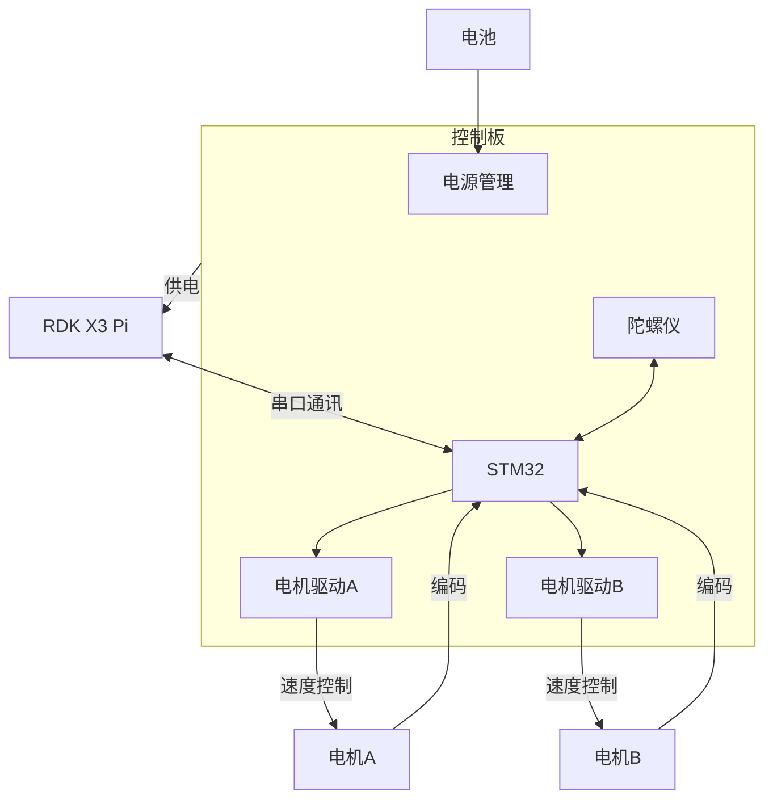
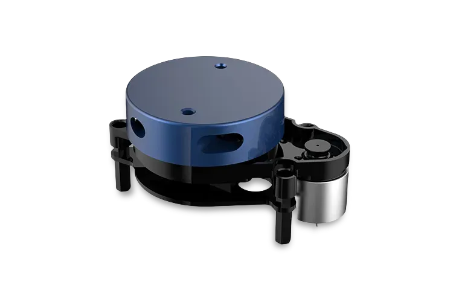
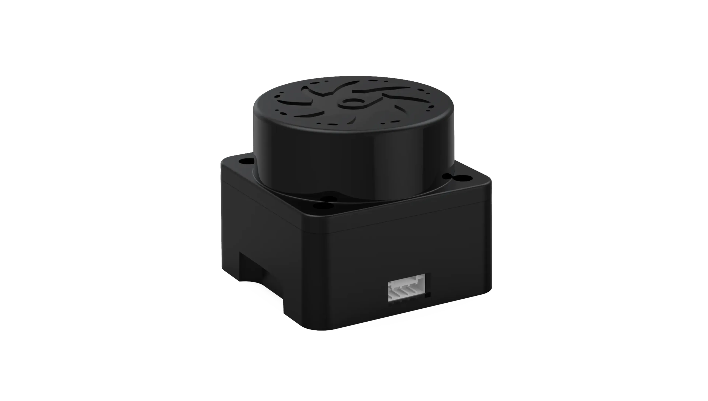

# OriginBot 实验思路

## 零阶段

### 目标

1. 安装 RDK X3 Pi 镜像
2. 通过VSCode中的SSH连接到 RDK X3 Pi

### 参考链接

[OriginBot智能机器人开源套件](http://originbot.org/)

[旭日X3派用户手册](https://developer.horizon.ai:8005/api/v1/fileData/documents_pi/index.html)

[D-Robotics RDK套件](https://d-robotics.github.io/rdk_doc/RDK)

[VSCode](https://code.visualstudio.com/)

## 一阶段

### 目标

1. 实现小车移动

### 车辆构成

**成车示意图**


|名称|图片|
|---|---|
|RDK X3||
|运动控制板||
|差速小车底盘||
|电池||
|激光雷达||
|摄像头||

### 车辆接线示意图



### RDK X3 40PIN 引脚示意图
旭日X3派开发板提供40PIN标准接口，方便用户进行外围扩展，其中数字IO采用3.3V电平设计。40PIN接口定义如下：

开发板40PIN接口位置提供了丝印网表，方便用户对照操作，PIN1、PIN40位置如下：


### 软件的实现思路

1. 保留驱动板代码，舍弃RDK X3代码
2. 查找上下位机通讯协议
3. 构建数据帧
4. 将移动的数据帧发送给运动控制板
5. 机器人移动

### 移动数据帧(0x01)详解

**数据帧的构成:**
**帧头 标识位 长度 数据 校验位 帧尾**

**速度控制数据帧**


**帧头**：0x55，帧头作为数据起始的标识，自定义0x55。

**标识位**：标识当前组数据是什么，0x01代表是速度控制指令。

**长度**：0x06，数据位共有6个字节数据，所以为0x06。

**数据位**：负责左电机速度控制和右电机速度控制。
Data=((short)DataH<<8)|DataL

**方向**：由0x00和0xFF两种模式，0x00速度值为负，0xFF速度值为正，当速度为0.00的情况下，方向值取0xFF。
速度单位为mm/s（8位）。

**校验位**：用于校验检测数据在传输的过程中是否出现数据错误。校验位数据计算公式如下：
**校验位数值 = 数据位所有数据相加 & 0xFF**

**帧尾**：0xBB，帧尾作为数据终止的标识，自定义0xBB。

**通讯速度示例**
左侧电机速度5mm/s，右电机速度-3mm/s
**0x55 0x01 0x06 0xFF 0x05 0x00 0x00 0x03 0x00 0x07 0xBB**
其中0xFF 0x50 0x00对应5mm/s；0x00 0x03 0x00对应-3mm/s。
校验位为
(0xFF + 0x05 + 0x00 + 0x00 + 0x03 + 0x00) & 0xFF = 0x07

### 全部数据帧

**标识位**

```python
CMD_SPEED_CONTROL = 0x01      # 上位机 -> STM32 : 速度控制
CMD_SPEED_FEEDBACK = 0x02     # STM32 -> 上位机 : 速度反馈
CMD_IMU_ACCEL = 0x03          # STM32 -> 上位机 : 加速度 (Ax,Ay,Az)
CMD_IMU_GYRO = 0x04           # STM32 -> 上位机 : 角速度 (Wx,Wy,Wz)
CMD_IMU_EULER = 0x05          # STM32 -> 上位机 : 欧拉角 (Roll,Pitch,Yaw)
CMD_SENSOR_DATA = 0x06        # STM32 -> 上位机 : 传感器数据（电压 + 2 预留）
CMD_DEVICE_CONTROL = 0x07     # 上位机 -> STM32 : LED/Buzzer/IMU校准
CMD_PID_PARAMS = 0x08         # 上位机 -> STM32 : PID 参数 (P,I,D)
```

#### 速度反馈数据帧(0x02)


**解析内容同上。** 启动标识位为0x02标识速度反馈指令。
注：速度为0时，方向字段的数据可能是0x00或0xFF。

#### 加速度(0x03), 角速度(0x04), 欧拉角(0x05)数据帧


陀螺仪数据较多，这里分为三组分别传输。通过标识位来区分当前数据是什么。校验位的计算依旧是使用数据位各个数据相加 & 0xFF。

**加速度计算方式为：**
ax=((AxH<<8)|AxL)/32768*16g 
ay=((AyH<<8)|AyL)/32768*16g
az=((AzH<<8)|AzL)/32768*16g
(g 为重力加速度，可取 9.8m/s2)

**角速度计算方式为：**
wx=((wxH<<8)|wxL)/32768*2000(°/s) 
wy=((wyH<<8)|wyL)/32768*2000(°/s) 
wz=((wzH<<8)|wzL)/32768*2000(°/s) 

**欧拉角计算方式为：**
滚转角（x 轴）Roll=((RollH<<8)|RollL)/32768*180(°) 
俯仰角（y 轴）Pitch=((PitchH<<8)|PitchL)/32768*180(°) 
偏航角（z 轴）Yaw=((YawH<<8)|YawL)/32768*180(°)

**说明：**
数据是按照16进制方式发送的，不是ASCII码。每个数据分低字节和高字节依次传送，二者组合成一个有符号的short 类型的数据。例如 X 轴加速度数据 Ax，其中 AxL 为低字节，AxH 为高字节。

转换方法如下：假设Data为实际的数据，DataH为其高字节部分，DataL为其低字节部分，那么：Data=((short)DataH<<8)|DataL。这里一定要注意 DataH 需要先强制转换为一个有符号的 short 类型的数据以后再移位，并且 Data 的数据类型也是有符号的short 类型，这样才能表示出负数。 

#### 传感器数据帧(0x06)


电压值分整数和小数两部分发送
**电压值=整数部分+小数部分/100**，单位为V。
预留两个传感器数据位，没有使用时数据为0x00，校验计算同上。

#### LED/Buzzer/IMU校准数据帧(0x07)


LED、蜂鸣器、imu校准指令的使能控制字段和状态字段可设置为零和非零值，校验计算同上。

使能控制字段非零时，状态字段的设置才能生效。LED、蜂鸣器和imu校准采用独立的使能控制和状态字段控制。

LED状态字段为零，则关闭LED；为非零，则打开LED。
蜂鸣器状态字段为零，则关闭蜂鸣器；为非零，则打开蜂鸣器。
imu校准状态字段为零，则无动作；为非零，则执行一次imu校准。

#### PID 参数数据帧(0x08)


PID参数作为外置预留，驱动板内置一组标定好的PID参数。
由于PID的数值较小，实际参数 = 数据字段/1000，校验计算同上。

#### 其他说明

**驱动板硬件资源**

直流编码电机 *2
IMU陀螺仪 *1
蜂鸣器（高电平触发） *1
LED灯（高电平触发） *1
电压检测电路 *1
电源管理 *1

**注：** 电源管理需具备5V 3A+的供电输出能力。

每次开机会校准陀螺仪，之后打印版本号
串口波特率115200
发送频率50HZ
LED是核心板上的蓝色LED（低电平亮）

### 代码实现

1. 建立串口连接
2. 构建数据帧
3. 通过串口发送数据帧
4. 车辆移动
5. 关闭串口连接
6. 结束

**构建串口并连接**

```python
ser = serial.Serial(port = "/dev/ttyS3", baudrate = 115200, timeout=0.1)
```

**构建数据帧**

```python
frame = [0x55, 0x01, 0x06, 0xFF, 0x05, 0x00, 0x00, 0x03, 0x00, 0x07, 0xBB]
frame = bytes(frame)
```

**通过串口发送数据帧**

```python
ser.write(frame)
```

**车辆移动**

```python
time.sleep(2)
```

**关闭串口连接**

```python
ser.close()
```

**整合**

```python
import serial
import time

ser = serial.Serial(port = "/dev/ttyS3", baudrate = 115200, timeout=0.1)
frame = [0x55, 0x01, 0x06, 0xFF, 0x05, 0x00, 0x00, 0x03, 0x00, 0x07, 0xBB]
frame = bytes(frame)
ser.write(frame)
time.sleep(2)
ser.close()
```
**ps：** 机器人不停为正常现象，发送速度为0的数据帧即可

### 代码使用方法

**ps：** 完整代码查看 **./source/OriginBot一阶段** ，可拷至机器人直接运行

将一阶段代码拷贝至小车home目录

**MAIN介绍**

**导入库**

```py
import time
from base import RobotController
from params import FrameParams
```

**创建移动对象**

```py
rc = RobotController(port="/dev/ttyS3", baudrate=115200)
```

**构建MAIN函数**

此段代码能实现控制左右轮按10mm/s走2s

```py
def main():
    rc.send_speed_control(10.0, 10.0)
    time.sleep(2)
    rc.send_speed_control(0.0, 0.0)
```

**程序主入口与异常处理模板**

```py
if __name__ == "__main__":
    try:
        main()

    except KeyboardInterrupt:
        rc.close()
        print("程序被用户中断")

    finally:
        rc.close()
        print("程序结束")
```

### RobotController类介绍

```py
rc = RobotController(port="/dev/ttyS3", baudrate=115200)
    """
    实例化对象，传入参数为串口端口与波特率
    ps：RDK X3 40PIN 上的串口为/dev/ttyS3，若改用其他开发板或串口，则需更改此处
    """
def send_speed_control(left_mm_s: int, right_mm_s: int)
    """
    发送速度控制命令
    参数：
        left_mm_s: 左轮速度（mm/s，带符号）
        right_mm_s: 右轮速度（mm/s，带符号）
    函数实现思路：
        1. 解析左右轮速度，按照通信协议构建数据帧
        2. 发送此数据帧
    """

def send_device_control(self, led_enable: int, led_state: int,
                        buz_enable: int, buz_state: int,
                        imu_enable: int, imu_state: int) -> bool:
    """
    发送LED、蜂鸣器、IMU校准控制命令
    参数：
        led_enable: LED使能字段
        led_state:  LED状态字段
        buz_enable: 蜂鸣器使能字段
        buz_state:  蜂鸣器状态字段
        imu_enable: IMU校准使能字段
        imu_state:  IMU校准状态字段
    函数实现思路：
        1. 构建数据帧并发送
    """
```

**ps:** 在RobotController类中，主要用send_speed_control函数。

## 二阶段
### 目标

1. 读取雷达数据

### 雷达介绍

**1. X2**

此款雷达是2024里昂套件中使用的

**2. X3**

此款雷达是OriginBot套件中的

**3. T-mini plus 12m**

此款雷达**可能**是2026上海套件中使用的

### 实现方法

参照 [YDLidar-SDK](https://github.com/YDLIDAR/YDLidar-SDK/tree/master) 中 [How to Build and Install](https://github.com/YDLIDAR/YDLidar-SDK/blob/master/doc/howto/how_to_build_and_install.md) 在开发板上构建出项目。

参照例程写出程序

### 有可能遇到的困难

**无法安装**

**可能的问题：**

1. 网络未连接
2. 系统时间不正确
3. 官方源被墙

**解决方法：**

1. 使用 ```sudo nmtui``` 命令连接WiFi

2. 使用 ```sudo date -s "yyyy-mm-dd hh:mm:ss"``` 命令来修改到正确时间
   
    注意时区。使用 ```date``` 命令查看系统时间与时区，若字段中包含CST，则使用北京时间（UTC+8）

3. 搜索国内镜像源

### YDLidarScanner类介绍
```py
lidar = YDLidarScanner("TMini")
    """
    实例化对象，传入参数为雷达名称
    目前仅支持TMini与X3，若使用OBot自带雷达，则把传入值改为X3即可
    """

def get_single_scan(self) -> Optional[List[Tuple[float, float]]]:
    """
    获取单次扫描数据（旋转一周的数据）
    
    Returns:
        Optional[List[Tuple[float, float]]]: 角度和距离的列表，每个元素为(角度, 距离)
                如果获取失败则返回None
    函数实现思路：
        按照官方例程抓取一圈数据
    """

def get_continuous_scans(self, num_scans: int = 10, interval: float = 0.1) -> List[List[Tuple[float, float]]]:
    """
    获取连续多次扫描数据
    
    Args:
        num_scans: 扫描次数
        interval: 每次扫描之间的间隔（秒）
        
    Returns:
        List[List[Tuple[float, float]]]: 多次扫描数据的列表
    """
```

## 三阶段

### 目标

1. 结合**RobotController类**与**YDLidarScanner类**，写出一个新类用于矫正

### WallCalibration类介绍
```py
robot = RobotController()
lidar = YDLidarScanner("TMini")
calibrator = WallCalibration(robot, lidar)
    """
    实例化对象，传入参数为实例化的RobotController对象与YDLidarScanner对象
    """

def align_to_wall(self, tolerance_percent=0.05, max_rotation_speed=50):
    """
    校准机器人平行于前墙
    
    Args:
        tolerance_percent: 两侧距离差的容忍百分比（默认0.05%）
        max_rotation_speed: 最大旋转速度（默认50）

    实现思路：
    1. 获取雷达前方左右30°的数据
    2. 计算这两个数据的平均值，并做差
    3. 根据差的大小，决定转的方向与速度
    4. 若差小于误差，结束函数
    """

def approach_to_wall(self, target_distance_cm=20, tolerance_cm=0.5, max_speed=50):
    """
    校准机器人前进到指定距离的墙面
    
    Args:
        target_distance_cm: 目标距离，单位厘米（默认20cm）
        tolerance_cm: 距离容忍度，单位厘米（默认0.5cm）
        max_speed: 最大前进速度（默认50）
   
    实现思路：
        1. 获取机器人前方左右5°的数据
        2. 将所有数据取均值
        3. 算出实际值和目标值的差
        4. 根据差的大小，决定移动的方向与速度
        5. 若差小于误差，结束函数
    """

def full_calibration(self, approach_distance=20,align_tolerance=0.05, approach_tolerance=0.5):
    """
    执行完整校准流程：先平行于墙面，再前进到指定距离
    
    Args:
        approach_distance: 前进目标距离（厘米）
        align_tolerance: 平行校准容忍度
        approach_tolerance: 前进校准容忍度（厘米）

    实现思路：
        1. 结合align_to_wall与align_to_wall
    """

```