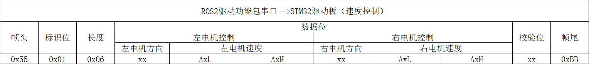
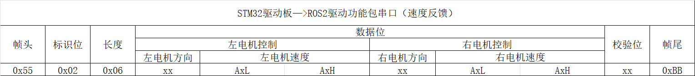
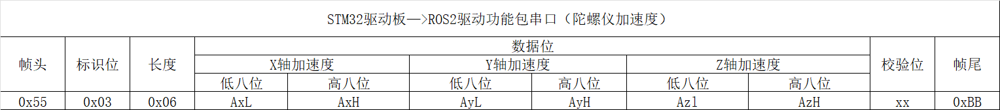
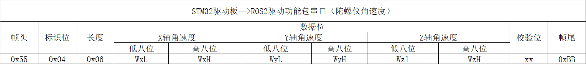
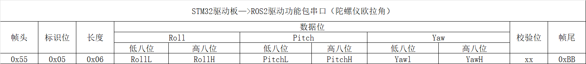
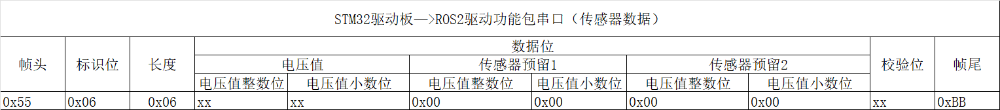
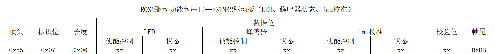
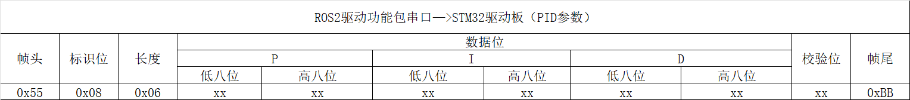

# 数据帧

## 移动数据帧(0x01)详解

### 数据帧的构成:

**帧头 标识位 长度 数据 校验位 帧尾**

### 速度控制数据帧



**帧头**：0x55，帧头作为数据起始的标识，自定义0x55。

**标识位**：标识当前组数据是什么，0x01代表是速度控制指令。

**长度**：0x06，数据位共有6个字节数据，所以为0x06。

**数据位**：负责左电机速度控制和右电机速度控制。
Data=((short)DataH<<8)|DataL

**方向**：由0x00和0xFF两种模式，0x00速度值为负，0xFF速度值为正，当速度为0.00的情况下，方向值取0xFF。
速度单位为mm/s（8位）。

**校验位**：用于校验检测数据在传输的过程中是否出现数据错误。校验位数据计算公式如下：
**校验位数值 = 数据位所有数据相加 & 0xFF**

**帧尾**：0xBB，帧尾作为数据终止的标识，自定义0xBB。

**通讯速度示例**
左侧电机速度5mm/s，右电机速度-3mm/s
**0x55 0x01 0x06 0xFF 0x05 0x00 0x00 0x03 0x00 0x07 0xBB**
其中0xFF 0x50 0x00对应5mm/s；0x00 0x03 0x00对应-3mm/s。
校验位为
(0xFF + 0x05 + 0x00 + 0x00 + 0x03 + 0x00) & 0xFF = 0x07

## 全部数据帧

**标识位**

```python
CMD_SPEED_CONTROL = 0x01      # 上位机 -> STM32 : 速度控制
CMD_SPEED_FEEDBACK = 0x02     # STM32 -> 上位机 : 速度反馈
CMD_IMU_ACCEL = 0x03          # STM32 -> 上位机 : 加速度 (Ax,Ay,Az)
CMD_IMU_GYRO = 0x04           # STM32 -> 上位机 : 角速度 (Wx,Wy,Wz)
CMD_IMU_EULER = 0x05          # STM32 -> 上位机 : 欧拉角 (Roll,Pitch,Yaw)
CMD_SENSOR_DATA = 0x06        # STM32 -> 上位机 : 传感器数据（电压 + 2 预留）
CMD_DEVICE_CONTROL = 0x07     # 上位机 -> STM32 : LED/Buzzer/IMU校准
CMD_PID_PARAMS = 0x08         # 上位机 -> STM32 : PID 参数 (P,I,D)
```

### 速度反馈数据帧(0x02)


**解析内容同上。** 启动标识位为0x02标识速度反馈指令。
注：速度为0时，方向字段的数据可能是0x00或0xFF。

### 加速度(0x03), 角速度(0x04), 欧拉角(0x05)数据帧




陀螺仪数据较多，这里分为三组分别传输。通过标识位来区分当前数据是什么。校验位的计算依旧是使用数据位各个数据相加 & 0xFF。

**加速度计算方式为：**
ax=((AxH<<8)|AxL)/32768*16g 
ay=((AyH<<8)|AyL)/32768*16g
az=((AzH<<8)|AzL)/32768*16g
(g 为重力加速度，可取 9.8m/s2)

**角速度计算方式为：**
wx=((wxH<<8)|wxL)/32768*2000(°/s) 
wy=((wyH<<8)|wyL)/32768*2000(°/s) 
wz=((wzH<<8)|wzL)/32768*2000(°/s) 

**欧拉角计算方式为：**
滚转角（x 轴）Roll=((RollH<<8)|RollL)/32768*180(°) 
俯仰角（y 轴）Pitch=((PitchH<<8)|PitchL)/32768*180(°) 
偏航角（z 轴）Yaw=((YawH<<8)|YawL)/32768*180(°)

**说明：**
数据是按照16进制方式发送的，不是ASCII码。每个数据分低字节和高字节依次传送，二者组合成一个有符号的short 类型的数据。例如 X 轴加速度数据 Ax，其中 AxL 为低字节，AxH 为高字节。

转换方法如下：假设Data为实际的数据，DataH为其高字节部分，DataL为其低字节部分，那么：Data=((short)DataH<<8)|DataL。这里一定要注意 DataH 需要先强制转换为一个有符号的 short 类型的数据以后再移位，并且 Data 的数据类型也是有符号的short 类型，这样才能表示出负数。 

### 传感器数据帧(0x06)


电压值分整数和小数两部分发送
**电压值=整数部分+小数部分/100**，单位为V。
预留两个传感器数据位，没有使用时数据为0x00，校验计算同上。

### LED/Buzzer/IMU校准数据帧(0x07)


LED、蜂鸣器、imu校准指令的使能控制字段和状态字段可设置为零和非零值，校验计算同上。

使能控制字段非零时，状态字段的设置才能生效。LED、蜂鸣器和imu校准采用独立的使能控制和状态字段控制。

LED状态字段为零，则关闭LED；为非零，则打开LED。
蜂鸣器状态字段为零，则关闭蜂鸣器；为非零，则打开蜂鸣器。
imu校准状态字段为零，则无动作；为非零，则执行一次imu校准。

### PID 参数数据帧(0x08)


PID参数作为外置预留，驱动板内置一组标定好的PID参数。
由于PID的数值较小，实际参数 = 数据字段/1000，校验计算同上。

### 其他说明

**驱动板硬件资源**

直流编码电机 *2
IMU陀螺仪 *1
蜂鸣器（高电平触发） *1
LED灯（高电平触发） *1
电压检测电路 *1
电源管理 *1

**注：** 电源管理需具备5V 3A+的供电输出能力。

每次开机会校准陀螺仪，之后打印版本号
串口波特率115200
发送频率50HZ
LED是核心板上的蓝色LED（低电平亮）