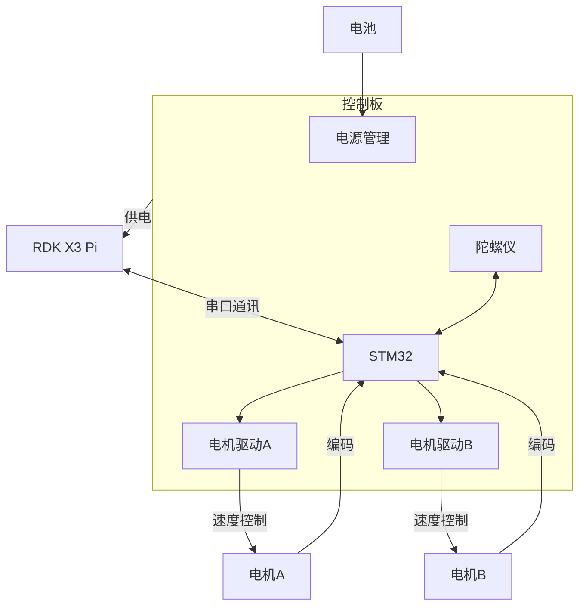

# 硬件构成

## 车辆构成

**成车示意图**

|名称|图片|
|---|---|
|RDK X3||
|运动控制板||
|差速小车底盘||
|电池||
|激光雷达||
|摄像头||

## 车辆接线示意图

## RDK X3 40PIN 引脚示意图
旭日X3派开发板提供40PIN标准接口，方便用户进行外围扩展，其中数字IO采用3.3V电平设计。40PIN接口定义如下：

开发板40PIN接口位置提供了丝印网表，方便用户对照操作，PIN1、PIN40位置如下：
