# 硬件构成

## 车辆构成

**成车示意图**
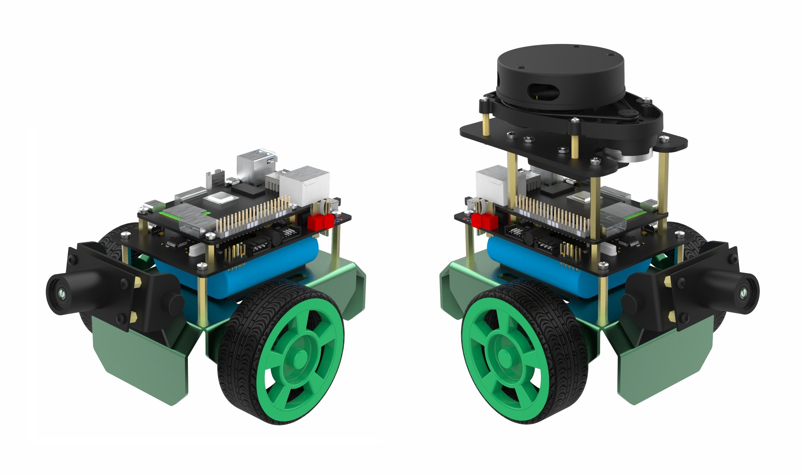

|名称|图片|
|---|---|
|RDK X3||
|运动控制板|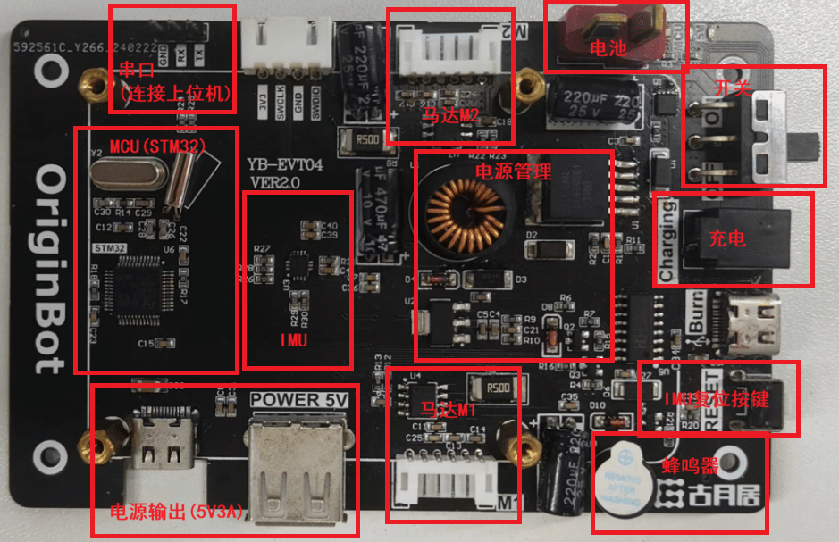|
|差速小车底盘|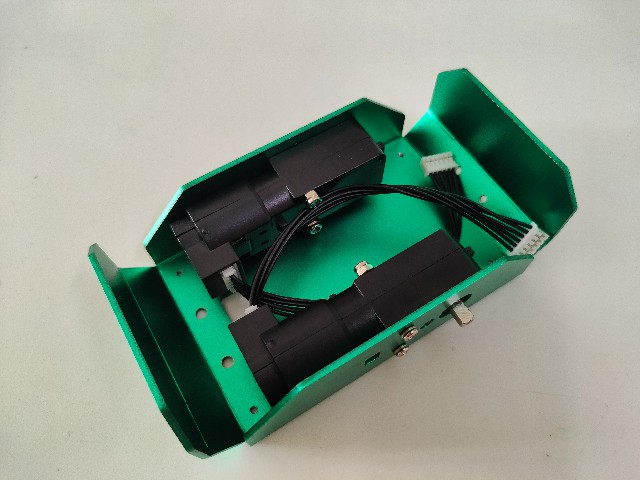|
|电池|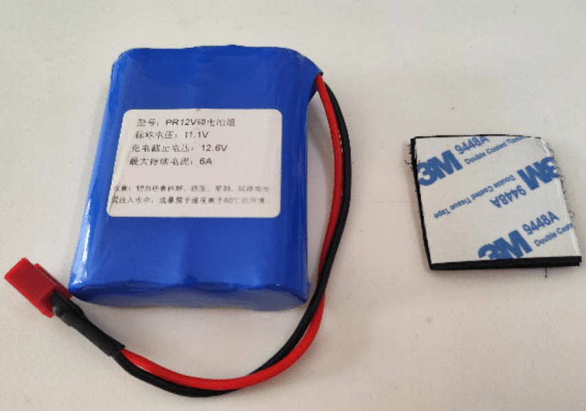|
|激光雷达|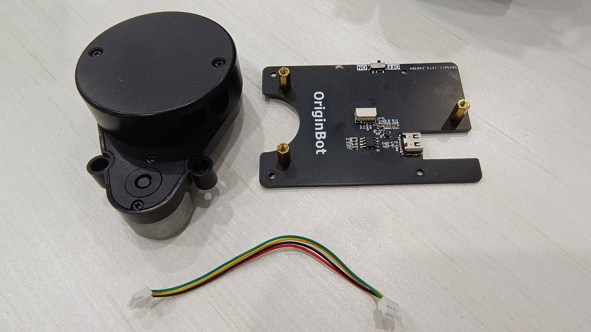|
|摄像头|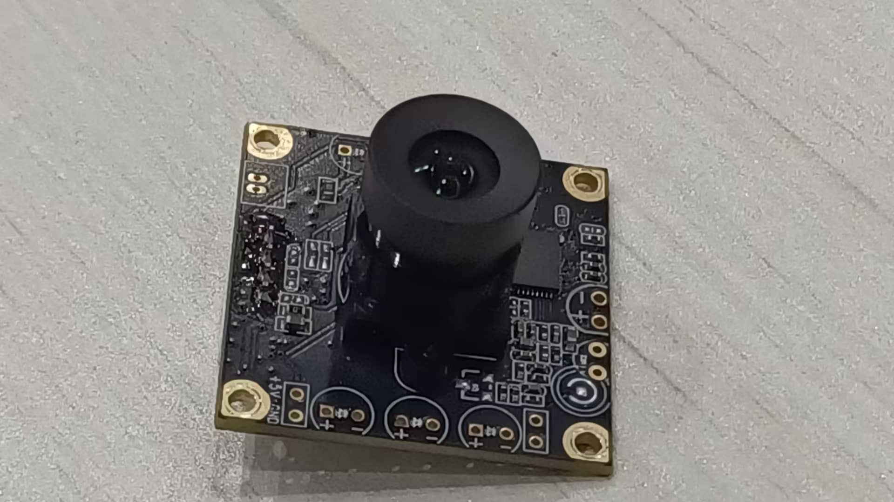|
|Type-C供电转接板|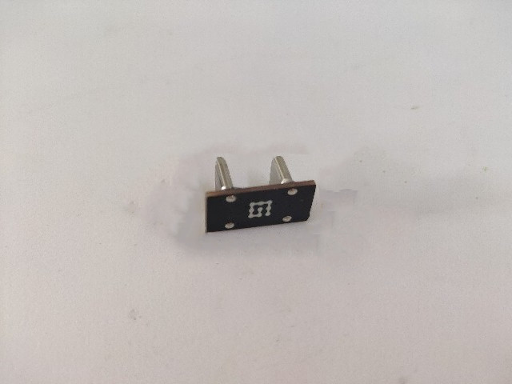|

## 车辆接线示意图

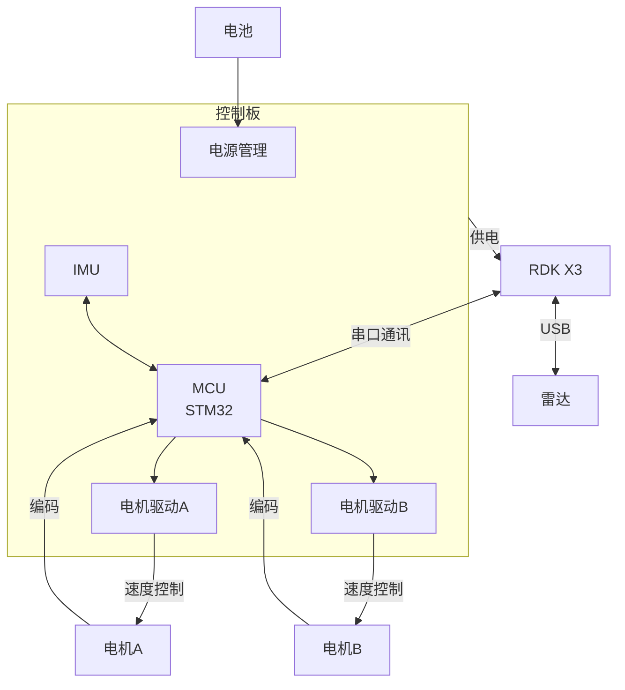
```mermaid
graph TD

    Pi[RDK X3]

    subgraph 控制板
        电源管理
        MCU[MCU<br>STM32]
        IMU
        电机驱动A
        电机驱动B
    end

    电池 --> 电源管理
    控制板 -- 供电 --> Pi
    Pi <-- 串口通讯 --> MCU
    IMU <--> MCU
    MCU --> 电机驱动A
    MCU --> 电机驱动B
    电机A -- 编码 --> MCU
    电机B -- 编码 --> MCU
    电机驱动A -- 速度控制 --> 电机A
    电机驱动B -- 速度控制 --> 电机B
    Pi <--USB--> 雷达

```

|左侧|右侧|
|---|---|
|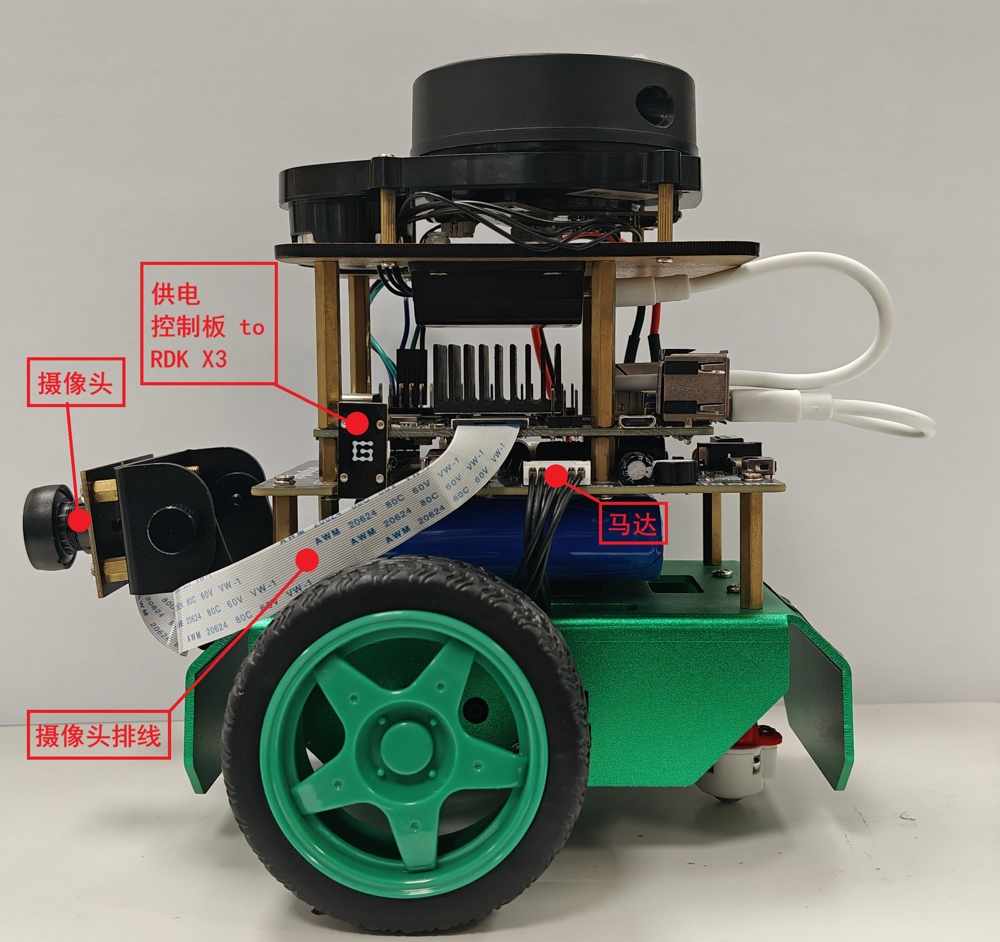|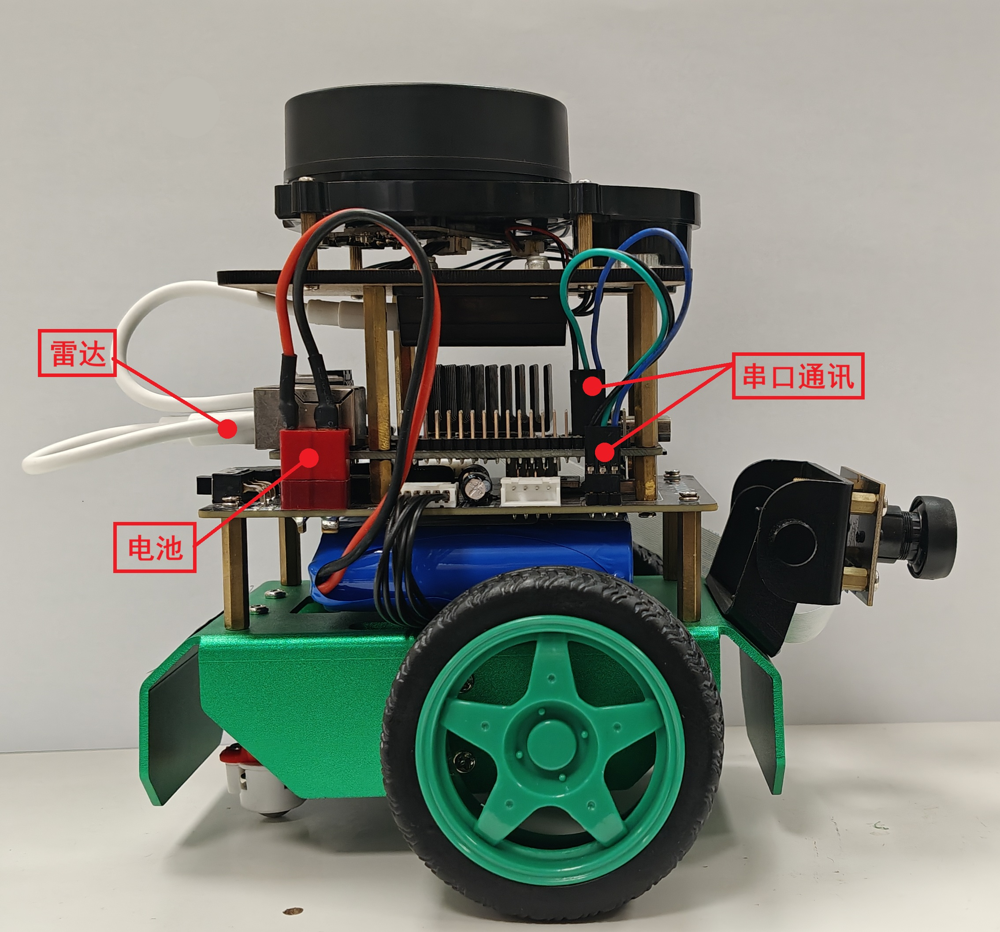|

## RDK X3 40PIN 引脚示意图
旭日X3派开发板提供40PIN标准接口，方便用户进行外围扩展，其中数字IO采用3.3V电平设计。40PIN接口定义如下：
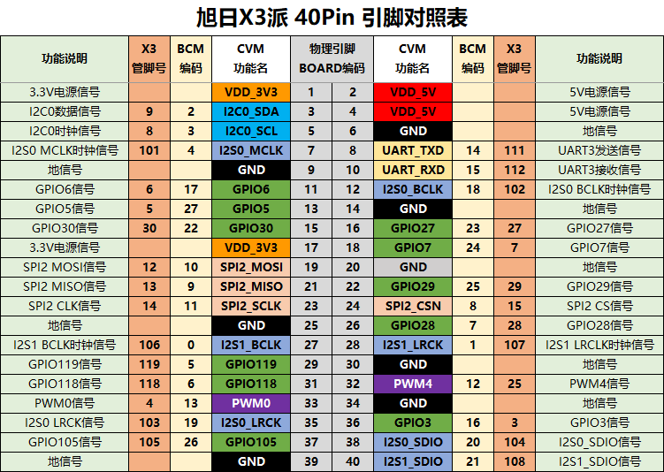
开发板40PIN接口位置提供了丝印网表，方便用户对照操作，PIN1、PIN40位置如下：
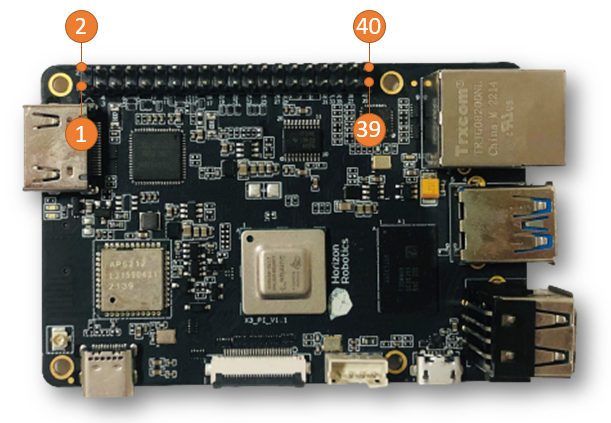

## 运动控制板电路图

